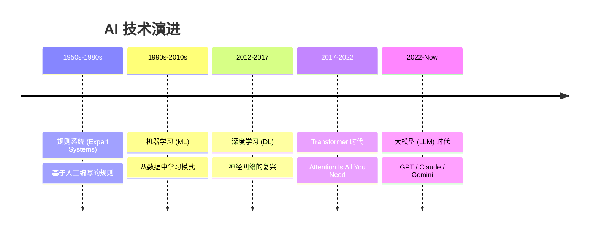
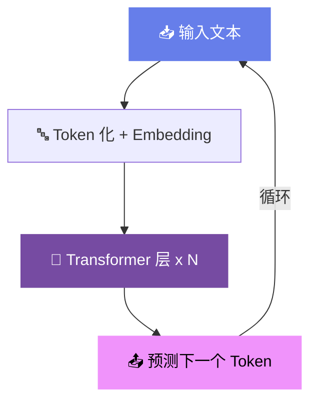

# 🧩 Module 1

## AI 与大模型基础

理解 AI 的核心概念与演进历程

---
layout: default
---

# AI 发展简史

<v-click>

> 💡 我们正处于 AI 技术的**寒武纪大爆发**时期

</v-click>

<!--
AI 并非一夜之间出现的技术，它经历了 70 多年的发展。
Transformer 架构在 2017 年彻底改变了 AI 的格局。
-->

---
layout: two-cols
---

# 什么是大语言模型？

<v-clicks>

- 🧠 **Large Language Model (LLM)**
  - 在海量文本上训练的深度神经网络
- 📝 **核心能力：预测下一个 Token**
  - "今天天气" → "真好" (概率最高)
- 🔤 **Token 化**
  - 文字被分割为最小处理单元
  - "人工智能" → ["人工", "智能"]
- 🎯 **涌现能力 (Emergence)**
  - 当模型足够大时，出现意想不到的能力

</v-clicks>

::right::

---
layout: default
---

# 模型参数与能力

参数量决定了模型的"大脑容量"

  
7B

  
轻量级

  
Llama 3.1 7B

  
✅ 简单对话 ⚠️ 推理能力有限

  
70B

  
专业级

  
Llama 3.1 70B

  
✅ 复杂推理 ✅ 代码生成

  
405B

  
旗舰级

  
Llama 3.1 405B

  
✅ 接近 GPT-4 级 ✅ 多语言精通

  
1T+

  
超级模型

  
GPT-4 / Claude Opus

  
✅ 顶级推理 ✅ 多模态

<v-click>

  ⚡ 参数量 ≠ 一切 — 架构设计、训练数据质量和训练方法同样关键

</v-click>

---
layout: default
---

# 模型家族一览 (1/2)

  

    <simple-icons-openai class="text-xl text-green-400" />
    OpenAI — GPT 系列
  

  
GPT-4o · o1 · o3 · GPT Image 2

  
多模态先驱，推理能力领先

  

    <mdi-robot class="text-xl text-orange-400" />
    Anthropic — Claude 系列
  

  
Haiku · Sonnet · Opus

  
编码与长文本之王

  

    <simple-icons-google class="text-xl text-blue-400" />
    Google — Gemini 系列
  

  
Flash · Pro · Ultra

  
原生多模态，百万上下文

  

    <simple-icons-meta class="text-xl text-blue-500" />
    Meta — LLaMA 系列
  

  
LLaMA 3.1 · 3.2 · 4

  
开源之王，推动民主化

---
layout: default
---

# 模型家族一览 (2/2)

  

    <carbon-model-alt class="text-xl text-cyan-400" />
    DeepSeek
  

  
DeepSeek-V3 · R1

  
中国开源强者，MoE 架构

  

    <carbon-cloud class="text-xl text-indigo-400" />
    xAI — Grok 系列
  

  
Grok 3 · Grok 3.5

  
Elon Musk 旗下，实时搜索

