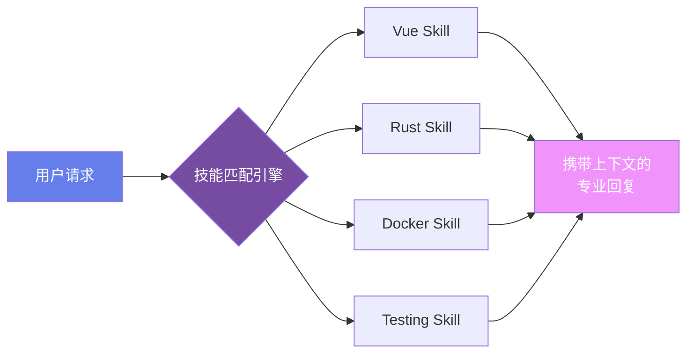

# 🛠️ Module 2

## Skills 技能系统

<div class="text-sm opacity-60 mt-4">Prompt Engineering 与 AI 技能定义</div>

---
layout: default
---

# 什么是 Prompt？

<div class="mt-4 text-lg">

> Prompt = **你给 AI 的指令**

</div>

<div class="grid grid-cols-3 gap-4 mt-8">

<div v-click class="p-4 rounded-lg" style="background: linear-gradient(135deg, #1a365d, #2d3748);">
  <div class="text-center mb-2">
    <carbon-chat class="text-3xl text-blue-400" />
  </div>
  <div class="font-bold text-center">自然语言输入</div>
  <div class="text-sm mt-2 opacity-70 text-center">"帮我写一个排序算法"</div>
</div>

<div v-click class="p-4 rounded-lg" style="background: linear-gradient(135deg, #2d3748, #553c9a);">
  <div class="text-center mb-2">
    <carbon-machine-learning-model class="text-3xl text-purple-400" />
  </div>
  <div class="font-bold text-center">模型处理</div>
  <div class="text-sm mt-2 opacity-70 text-center">理解意图 → 生成回复</div>
</div>

<div v-click class="p-4 rounded-lg" style="background: linear-gradient(135deg, #553c9a, #9b2c2c);">
  <div class="text-center mb-2">
    <carbon-code class="text-3xl text-pink-400" />
  </div>
  <div class="font-bold text-center">结构化输出</div>
  <div class="text-sm mt-2 opacity-70 text-center">代码、文本、图片...</div>
</div>

</div>

<v-click>

<div class="mt-6 p-3 rounded-lg border border-yellow-500/30" style="background: rgba(236, 201, 75, 0.05);">
  ⚡ Prompt 的质量直接决定 AI 输出的质量 — <strong>"Garbage In, Garbage Out"</strong>
</div>

</v-click>

---
layout: default
---

# Prompt Engineering 技巧

<div class="grid grid-cols-3 gap-6 mt-6">

<div v-click>

### 🎯 Zero-Shot

直接提问，无示例

```
将以下文本翻译为日语：
"Hello World"
```

<div class="text-xs mt-2 opacity-50">适合简单、明确的任务</div>

</div>

<div v-click>

### 📋 Few-Shot

提供几个示例

```
正面: "这部电影太好看了" → 😊
负面: "服务态度很差" → 😡
请判断: "今天心情不错"
```

<div class="text-xs mt-2 opacity-50">通过示例引导模型理解模式</div>

</div>

<div v-click>

### 🔗 Chain-of-Thought

引导逐步推理

```
一步一步思考：
1. 先分析问题
2. 列出关键信息
3. 推导结论
4. 验证答案
```

<div class="text-xs mt-2 opacity-50">复杂推理任务的金钥匙</div>

</div>

</div>

<v-click>

<div class="mt-6 text-center">

| 技巧 | 适用场景 | 效果提升 |
|------|---------|---------|
| Zero-Shot | 简单任务 | ⭐ |
| Few-Shot | 格式化输出 | ⭐⭐⭐ |
| Chain-of-Thought | 复杂推理 | ⭐⭐⭐⭐⭐ |

</div>

</v-click>

---
layout: two-cols
---

# System Prompt

## AI 的"人格基因"

<v-clicks>

- 🎭 **定义角色**
  - "你是一名资深前端工程师"
- 📏 **设定规则**
  - "所有回复使用中文"
  - "代码使用 TypeScript"
- 🚫 **约束边界**
  - "不要生成有害内容"
- 🎯 **明确目标**
  - "优先考虑代码可维护性"

</v-clicks>

::right::

<div class="ml-4 mt-6">

```yaml {all|1-2|3-5|6-8|all}
# 一个典型的 System Prompt
role: 资深全栈工程师

## 技术栈
- 前端: Vue 3 + TypeScript
- 后端: Rust + Axum
- 数据库: PostgreSQL

## 行为规范
- 使用中文回复
- 代码遵循最佳实践
- 提供详细注释

## 约束
- 不要使用已弃用的 API
- 优先使用 Composition API
- 错误处理不可省略
```

</div>

---
layout: default
---

# Skills 技能包 (1/2)

将 AI 的专业能力**模块化、可复用**

<div class="mt-8">



</div>

---
layout: default
---

# Skills 技能包 (2/2)

将 AI 的专业能力**模块化、可复用**

<div class="grid grid-cols-2 gap-6 mt-8">

<div>

```yaml
# SKILL.md 结构
---
name: vue-best-practices
description: Vue 3 最佳实践指南
---

## 触发条件
- 当用户编写 .vue 文件
- 当讨论 Vue 架构

## 核心规则
- 使用 Composition API
- 使用 <script setup>
- 使用 TypeScript
```

</div>

<div>

```yaml
# 技能包的力量
# 一次定义，处处生效

✅ 自动加载相关技能
✅ 上下文感知
✅ 与代码库绑定
✅ 团队共享标准

# 你的 AI 助手瞬间变成
# 该领域的专家 💪
```

</div>

</div>
