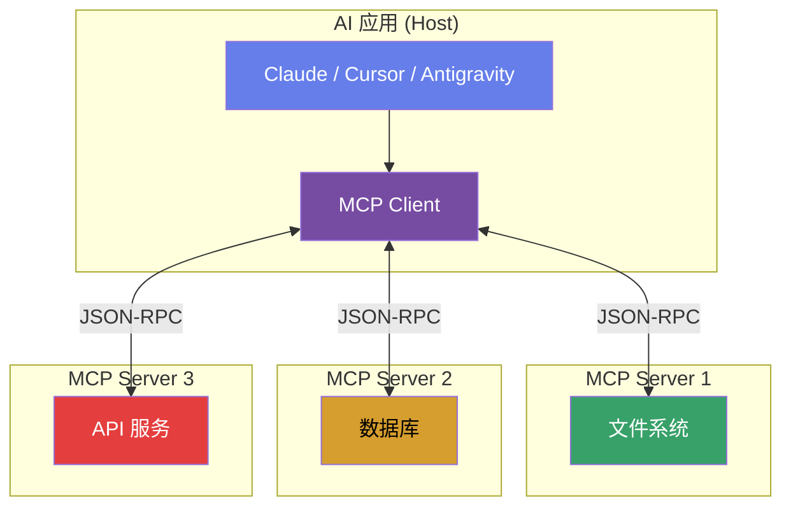

# 🔌 Module 3

## MCP — Model Context Protocol

<div class="text-sm opacity-60 mt-4">AI 的"USB 接口" — 让模型连接外部世界</div>

---
layout: default
---

# 为什么需要 MCP？

<v-clicks>

- 😅 **痛点：大模型是"信息孤岛"**
  - 无法读写文件、无法查询数据库、无法调用 API
- 🔌 **解法：MCP = AI 的 USB 接口**
  - 标准化协议，让任何模型连接任何工具
- 🌍 **USB 之前** → 每个设备专属接口，碎片化
- 🌍 **USB 之后** → 统一接口，即插即用
- 📢 **Anthropic** 于 2024 年发布 MCP 开放标准

</v-clicks>

---
layout: default
---

# MCP 架构



---
layout: default
---

# MCP 三大核心原语

<div class="grid grid-cols-3 gap-6 mt-8">

<div v-click class="p-5 rounded-lg text-center" style="background: linear-gradient(135deg, #1a365d, #2c5282);">
  <carbon-tool-box class="text-4xl text-blue-300 mb-3" />
  <div class="text-lg font-bold">Tools</div>
  <div class="text-sm mt-2 opacity-80">AI 可执行的操作</div>
  <div class="text-xs mt-3 opacity-60">读文件、查数据库、调 API</div>
</div>

<div v-click class="p-5 rounded-lg text-center" style="background: linear-gradient(135deg, #2d3748, #553c9a);">
  <carbon-data-base class="text-4xl text-purple-300 mb-3" />
  <div class="text-lg font-bold">Resources</div>
  <div class="text-sm mt-2 opacity-80">AI 可读取的数据</div>
  <div class="text-xs mt-3 opacity-60">项目结构、配置文件、文档</div>
</div>

<div v-click class="p-5 rounded-lg text-center" style="background: linear-gradient(135deg, #553c9a, #9b2c2c);">
  <carbon-text-creation class="text-4xl text-pink-300 mb-3" />
  <div class="text-lg font-bold">Prompts</div>
  <div class="text-sm mt-2 opacity-80">预定义的交互模式</div>
  <div class="text-xs mt-3 opacity-60">代码审查模板、翻译工作流</div>
</div>

</div>

---
layout: default
---

# MCP 生态与配置 (1/2)

| 分类 | MCP Server | 功能 |
|------|-----------|------|
| 📁 文件系统 | `filesystem` | 读写本地文件 |
| 🗄️ 数据库 | `postgres-mcp` | SQL 查询 |
| 🌐 浏览器 | `browser-mcp` | 网页浏览 |
| 📊 API | `apifox-mcp` | API 调用 |
| 🐙 代码 | `github-mcp` | PR/Issue 管理 |

---
layout: default
---

# MCP 生态与配置 (2/2)

MCP 的配置文件通常为 JSON 格式：

```json
// MCP 配置示例
{
  "servers": {
    "filesystem": {
      "command": "npx",
      "args": ["-y", "@anthropic/mcp-filesystem", "/projects"]
    },
    "github": {
      "command": "npx",
      "args": ["-y", "@anthropic/mcp-github"],
      "env": { "GITHUB_TOKEN": "ghp_xxx" }
    }
  }
}
```
