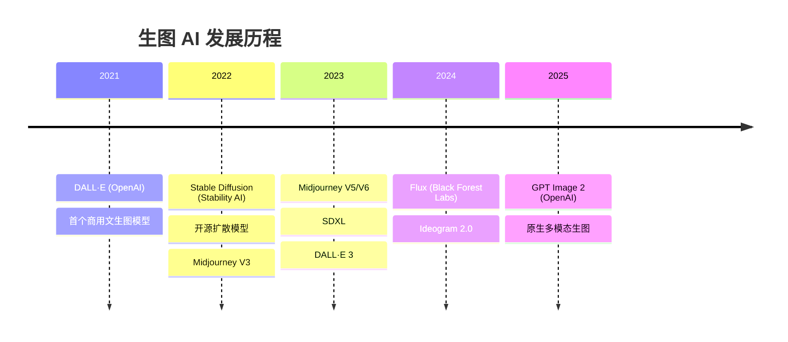

# 🎨 Module 4

## 顶级生图模型

<div class="text-sm opacity-60 mt-4">从 DALL·E 到 GPT Image 2 — 视觉创造力的飞跃</div>

---
layout: default
---

# 生图模型演进史



---
layout: two-cols
---

# GPT Image 2 深度解析

<v-clicks>

- 🧬 **原生多模态**
  - 不是"嫁接"的，而是模型原生能力
  - 同一个模型理解和生成图像
- ✍️ **文字渲染能力**
  - 首次做到图内文字精确可控
  - 海报、Logo、UI 设计利器
- 🎨 **风格控制**
  - 支持自然语言描述风格
  - 可参考上传图片的风格
- 🔄 **图片编辑**
  - 支持局部修改（Inpainting）
  - 多轮对话式迭代

</v-clicks>

::right::

<div class="ml-6 mt-8 p-4 rounded-lg" style="background: linear-gradient(135deg, rgba(102,126,234,0.2), rgba(118,75,162,0.2));">

**示例 Prompt：**

```
一个极简主义风格的 Logo，
包含文字 "AI LESSON"，
使用渐变紫蓝色调，
黑色背景，
科技感强烈，
矢量风格
```

<div class="mt-4 text-xs opacity-60">
GPT Image 2 的文字渲染能力<br/>
远超其他竞品
</div>

</div>

---
layout: default
---

# 模型能力对比

| 能力 | GPT Image 2 | Flux Pro | Midjourney V6 | DALL·E 3 |
|------|:-----------:|:--------:|:-------------:|:--------:|
| 文字渲染 | ⭐⭐⭐⭐⭐ | ⭐⭐⭐ | ⭐⭐ | ⭐⭐⭐ |
| 风格控制 | ⭐⭐⭐⭐⭐ | ⭐⭐⭐⭐ | ⭐⭐⭐⭐⭐ | ⭐⭐⭐ |
| 真实感 | ⭐⭐⭐⭐ | ⭐⭐⭐⭐⭐ | ⭐⭐⭐⭐⭐ | ⭐⭐⭐ |
| 指令遵循 | ⭐⭐⭐⭐⭐ | ⭐⭐⭐⭐ | ⭐⭐⭐ | ⭐⭐⭐⭐ |
| 图片编辑 | ⭐⭐⭐⭐⭐ | ⭐⭐ | ⭐ | ⭐⭐⭐ |
| 速度 | ⭐⭐⭐ | ⭐⭐⭐⭐ | ⭐⭐⭐ | ⭐⭐⭐⭐ |
| 开源 | ❌ | ✅ 部分 | ❌ | ❌ |

<v-click>

<div class="mt-4 p-3 rounded-lg border border-blue-500/30" style="background: rgba(102,126,234,0.08);">
  🏆 <strong>GPT Image 2</strong> 在文字渲染和指令遵循上有压倒性优势，<strong>Midjourney</strong> 在艺术风格上仍然最强
</div>

</v-click>

---
layout: default
---

# 生图 Prompt 公式

<div class="mt-6 p-4 rounded-lg text-center text-lg" style="background: linear-gradient(135deg, rgba(102,126,234,0.2), rgba(118,75,162,0.2));">
  <strong>主体</strong> + <strong>风格</strong> + <strong>光线</strong> + <strong>构图</strong> + <strong>细节</strong>
</div>

<div class="grid grid-cols-2 gap-6 mt-6">

<div v-click>

### ❌ 差的 Prompt

```
画一只猫
```

<div class="text-sm mt-2 text-red-400">模糊、无约束、结果随机</div>

</div>

<div v-click>

### ✅ 好的 Prompt

```
一只橘色英短猫，蹲坐在
旧书堆上，柔和的自然光
从左侧窗户射入，浅景深，
暖色调，35mm 胶片质感，
宫崎骏风格水彩画
```

<div class="text-sm mt-2 text-green-400">明确主体、风格、光线、构图</div>

</div>

</div>

<v-click>

<div class="mt-6">

| 元素 | 作用 | 示例关键词 |
|------|------|-----------|
| 主体 | 画什么 | 人物、动物、建筑、风景 |
| 风格 | 什么画风 | 写实、水彩、赛博朋克、像素 |
| 光线 | 氛围感 | 黄金时刻、逆光、霓虹灯 |
| 构图 | 怎么拍 | 特写、鸟瞰、三分法、对称 |
| 细节 | 精修度 | 4K、超细节、8K 渲染 |

</div>

</v-click>
