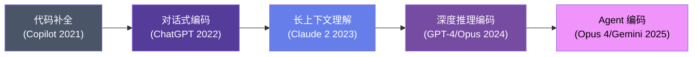

# 💻 Module 5

## 顶级编码模型

<div class="text-sm opacity-60 mt-4">Claude Opus — 编码 AI 的王者</div>

---
layout: default
---

# 编码模型的演进



<v-clicks>

- 📝 **第一阶段**：单行代码补全 (Tab 补全)
- 💬 **第二阶段**：对话式编码 (问答生成)
- 📚 **第三阶段**：理解整个代码库上下文
- 🧠 **第四阶段**：复杂推理 + 架构设计
- 🤖 **第五阶段**：自主 Agent 编码 ← **我们在这里**

</v-clicks>

---
layout: two-cols
---

# Claude Opus 深度解析

<v-clicks>

- 🧠 **超强推理能力**
  - 编码 Benchmark 业界顶级
  - 复杂算法和架构设计能力突出
- 📚 **超长上下文**
  - 200K Token 上下文窗口
  - 可理解整个代码库
- 🏗️ **架构理解**
  - 不仅写代码，更理解设计模式
  - 跨文件依赖分析
- 🎯 **精确度**
  - 代码生成一次通过率高
  - 错误率远低于同类模型
- 🔧 **工具使用**
  - 原生支持 Tool Use
  - 完美适配 Agent 工作流

</v-clicks>

::right::

<div class="ml-4 mt-6">

````md magic-move
```typescript
// 💡 用自然语言描述需求
// "创建一个带缓存的 API 请求函数"
```
```typescript
// Claude Opus 生成：
async function cachedFetch<T>(
  url: string,
  options?: RequestInit,
  ttl = 300_000,
): Promise<T> {
  const key = `cache:${url}`
  const cached = cache.get(key)

  if (cached && !isExpired(cached, ttl))
    return cached.data as T

  const res = await fetch(url, options)
  const data = await res.json()

  cache.set(key, {
    data,
    timestamp: Date.now(),
  })

  return data as T
}
```
````

</div>

---
layout: default
---

# 编码模型对比

| 能力维度 | Claude Opus | GPT-4o | Gemini 2.5 Pro |
|---------|:-----------:|:------:|:--------------:|
| 代码生成 | ⭐⭐⭐⭐⭐ | ⭐⭐⭐⭐ | ⭐⭐⭐⭐ |
| 深度推理 | ⭐⭐⭐⭐⭐ | ⭐⭐⭐⭐ | ⭐⭐⭐⭐⭐ |
| 上下文长度 | 200K | 128K | 1M |
| Bug 修复 | ⭐⭐⭐⭐⭐ | ⭐⭐⭐⭐ | ⭐⭐⭐⭐ |
| 架构设计 | ⭐⭐⭐⭐⭐ | ⭐⭐⭐ | ⭐⭐⭐⭐ |
| 工具调用 | ⭐⭐⭐⭐⭐ | ⭐⭐⭐⭐ | ⭐⭐⭐⭐ |
| 指令遵循 | ⭐⭐⭐⭐⭐ | ⭐⭐⭐⭐ | ⭐⭐⭐⭐ |
| 速度 | ⭐⭐⭐ | ⭐⭐⭐⭐⭐ | ⭐⭐⭐⭐ |
| 性价比 | ⭐⭐⭐ | ⭐⭐⭐⭐ | ⭐⭐⭐⭐⭐ |

<v-click>

<div class="mt-4 p-3 rounded-lg border border-purple-500/30" style="background: rgba(118,75,162,0.08);">
  🏆 <strong>Claude Opus</strong> 在代码生成和架构设计上综合最强，<strong>Gemini 2.5 Pro</strong> 凭借百万上下文和性价比紧随其后
</div>

</v-click>

---
layout: default
---

# 高效协作最佳实践

<div class="grid grid-cols-2 gap-6 mt-6">

<div v-click>

### ✅ 应该这样做

```markdown
# 清晰的需求描述
1. 使用 TypeScript + Vue 3
2. 实现用户登录表单
3. 包含邮箱和密码字段
4. 使用 Zod 做表单验证
5. 提交后调用 /api/login
6. 错误时显示 Toast 提示
```

</div>

<div v-click>

### ❌ 不要这样做

```markdown
# 模糊的需求
帮我写个登录页面

# 为什么不好？
- 什么技术栈？
- 哪些字段？
- 怎么验证？
- 错误怎么处理？
- API 接口是什么？
```

</div>

</div>

<v-click>

<div class="mt-6 p-3 rounded-lg" style="background: linear-gradient(135deg, rgba(56,161,105,0.15), rgba(49,130,206,0.15));">
  💡 <strong>黄金法则：</strong>把 AI 当作一个能力很强但完全不了解你项目背景的新同事
</div>

</v-click>
