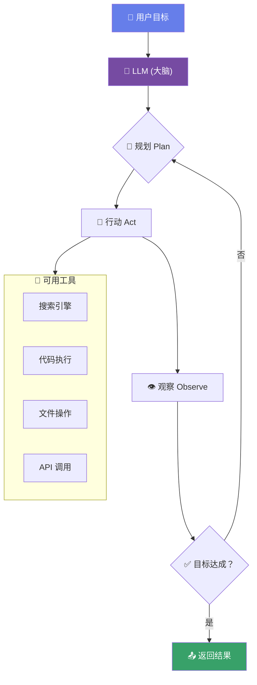

# 🤖 Module 6

## LLM Agent

<div class="text-sm opacity-60 mt-4">从"对话"到"行动" — AI 的自主执行能力</div>

---
layout: default
---

# 什么是 Agent？

<div class="mt-4">

> **Agent = LLM + 工具 + 自主决策循环**

</div>

<div class="grid grid-cols-2 gap-8 mt-6">

<div v-click>

### 💬 普通 LLM 对话

```
用户: 帮我查一下天气
AI: 我无法访问实时数据，
    但我可以告诉你如何查询...
```

<div class="text-sm mt-2 text-red-400">只能"说"，不能"做"</div>

</div>

<div v-click>

### 🤖 LLM Agent

```
用户: 帮我查一下天气
Agent: [调用天气 API]
       → 获取到数据
       → 当前北京 25°C 晴天
       → 适合户外活动 ☀️
```

<div class="text-sm mt-2 text-green-400">能"想"也能"做"！</div>

</div>

</div>

<v-click>

<div class="mt-6 p-3 rounded-lg" style="background: linear-gradient(135deg, rgba(102,126,234,0.15), rgba(118,75,162,0.15));">
  🧠 Agent 的核心突破：让 AI 不仅生成文本，还能<strong>使用工具、执行操作、自主决策</strong>
</div>

</v-click>

---
layout: default
---

# Agent 核心架构



<v-click>

<div class="text-center mt-2 text-sm opacity-70">
  🔄 <strong>ReAct Loop</strong>: Reasoning (推理) + Acting (行动) 的循环
</div>

</v-click>

---
layout: default
---

# Function Calling — 工具调用

<div class="mt-4">

AI 如何"使用工具"的？

</div>

````md magic-move
```json
// Step 1: 用户发起请求
{ "role": "user", "content": "北京今天天气怎么样？" }
```
```json
// Step 2: AI 决定调用工具
{
  "role": "assistant",
  "tool_calls": [{
    "name": "get_weather",
    "arguments": { "city": "北京" }
  }]
}
```
```json
// Step 3: 工具返回结果
{
  "role": "tool",
  "content": { "temp": 25, "condition": "晴", "humidity": 40 }
}
```
```json
// Step 4: AI 基于结果回复
{
  "role": "assistant",
  "content": "北京今天 25°C，晴天，湿度 40%，非常适合出门！☀️"
}
```
````

---
layout: default
---

# Agent 生态一览

<div class="grid grid-cols-2 gap-6 mt-6">

<div v-click class="p-4 rounded-lg border border-gray-600">
  <div class="font-bold mb-2">🦜 LangChain / LangGraph</div>
  <div class="text-sm opacity-70">最流行的 Agent 框架，链式调用，丰富的工具集成</div>
</div>

<div v-click class="p-4 rounded-lg border border-gray-600">
  <div class="font-bold mb-2">🚢 CrewAI</div>
  <div class="text-sm opacity-70">多 Agent 协作框架，角色定义，任务分配</div>
</div>

<div v-click class="p-4 rounded-lg border border-gray-600">
  <div class="font-bold mb-2">🔄 AutoGen (Microsoft)</div>
  <div class="text-sm opacity-70">多 Agent 对话框架，Agent 间自主沟通</div>
</div>

<div v-click class="p-4 rounded-lg border border-gray-600">
  <div class="font-bold mb-2">⚡ Vercel AI SDK</div>
  <div class="text-sm opacity-70">Web 优先的 AI 工具包，流式响应，多模型支持</div>
</div>

<div v-click class="p-4 rounded-lg border border-gray-600">
  <div class="font-bold mb-2">🤖 Mastra</div>
  <div class="text-sm opacity-70">TypeScript Agent 框架，工作流编排，内存管理</div>
</div>

<div v-click class="p-4 rounded-lg border border-gray-600">
  <div class="font-bold mb-2">🧩 Dify / Coze</div>
  <div class="text-sm opacity-70">低代码 Agent 平台，可视化编排，快速上手</div>
</div>

</div>
