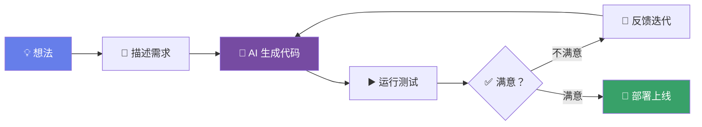
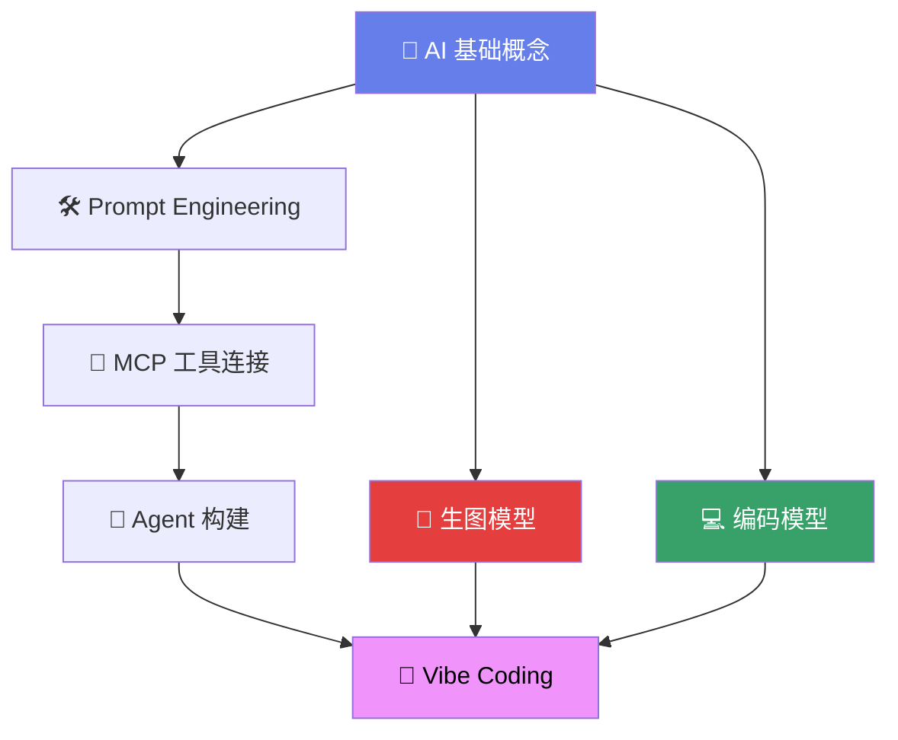

# 🎸 Module 7

## Vibe Coding

"不写代码"的编程革命

---
layout: quote
---

# "I just see things, say things, run things, and copy-paste things, and it mostly works."

  — Andrej Karpathy, 2025

  前特斯拉 AI 总监、OpenAI 联合创始人提出的全新编程范式

---
layout: default
---

# 什么是 Vibe Coding？

<v-clicks>

- 🎸 **核心理念："跟着感觉走"**
  - 用自然语言描述你想要什么
  - AI 负责生成代码
  - 你负责审查和迭代

- 🔄 **工作流**
  - 描述需求 → AI 生成 → 运行测试 → 迭代优化

- 🎯 **关键转变**
  - ~~手写每一行代码~~ → 描述意图
  - ~~调试语法错误~~ → 审查逻辑
  - ~~查阅 API 文档~~ → 对话式开发

- ⚠️ **注意：Vibe Coding ≠ 不需要编程知识**
  - 你仍需理解代码来做出正确判断

</v-clicks>

---
layout: default
---

# Vibe Coding 工具链

  

    <carbon-code class="text-xl text-blue-300" />
    Cursor
  

  
VS Code 分支，AI-First 编辑器

  
Tab 补全 · Chat · Composer 多文件编辑

  

    <carbon-terminal class="text-xl text-purple-300" />
    Claude Code
  

  
Anthropic 官方终端 Agent

  
命令行原生 · 自主执行 · 深度推理

  

    <carbon-rocket class="text-xl text-pink-300" />
    Windsurf
  

  
Codeium 出品的 AI 编辑器

  
Cascade 工作流 · 上下文感知 · 自动操作

  

    <carbon-model-alt class="text-xl text-green-300" />
    Antigravity (Google)
  

  
Google DeepMind 的编码助手

  
Gemini 原生 · 浏览器控制 · 技能系统

---
layout: default
---

# Vibe Coding 实战流程

<v-click>

  
Step 1

  
"创建一个 Todo App 使用 Vue 3 + Pinia"

  
Step 2

  
AI 生成完整项目 组件、路由、状态管理

  
Step 3

  
"加上暗色模式 和动画过渡效果"

</v-click>

---
layout: center
---

# 🗺️ AI 学习路线图

  从理解 AI → 使用 AI → 构建 AI 应用 → <strong>用 AI 写代码</strong>

---
layout: center
class: text-center
---

# 感谢学习！🎉

  AI 新纪元 — 从入门到 Vibe Coding

  <carbon-logo-github class="inline" /> 课程源码开放 · 持续更新

  
    开始你的 AI 之旅 →
  

